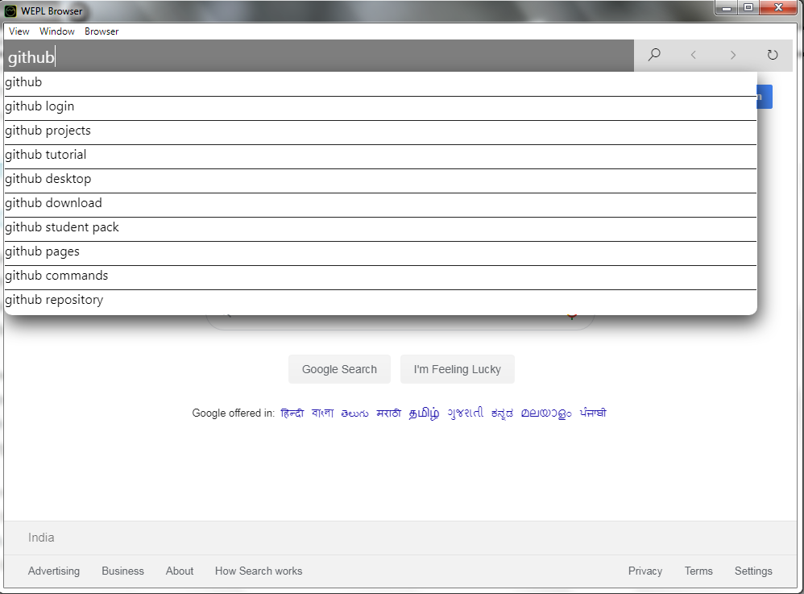

# WEPL

WEPL stands for WEb PLaygound. It is a application created to make web apps on the go, without any hassle about files.

Here is a screenshot of the editor:

# Live Server, Emmet, Prettier

## Live Server

Who doesn't like live reloading?? WEPL comes with live server built-in to serve your awesome app right in the link (http://127.0.0.1:80)

## Emmet

The tool that makes writing HTML way easier. In-built in WEPL. Get the documentation for Emmet [here](https://docs.emmet.io) and the cheat sheet for Emmet [here](https://docs.emmet.io/cheat-sheet/). To expand your Emmet abbr. thpe in the abbr. and when the completion shows a Emmet abbr. hit <kbd>Tab</kbd> to expand it.

## Prettier

Now don't fear writing beautiful code. WEPL has got Prettier to format your files in one stroke. To format your current file, hit <kbd>Shift</kbd>+<kbd>Alt</kbd>+<kbd>F</kbd>.

If you want to see alll these three in action, head to [./screenshots/editor-in-action.mp4](\screenshots\editor-in-action.mp4) in the repository.

# Built-in Browser

WEPL boasts of a built-in browser. To search for something, type it and hit <kbd>Enter</kbd> to search it on GitHub.

To type a url, just add '//' before the url in the search bar:

